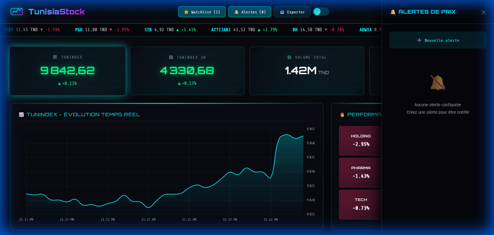

# 📊 TunisiaStock Dashboard



[](https://reactjs.org/)
[](https://vitejs.dev/)
[](https://nodejs.org/)
[](https://socket.io/)
[](LICENSE)

> **Un dashboard boursier cyberpunk en temps réel pour la Bourse de Tunis (BVMT).**  
> Visualisez le marché tunisien comme jamais auparavant avec des graphiques live, une heatmap sectorielle et des notifications de prix.

---

## ✨ Fonctionnalités

### 🖥️ Interface & UX
- **Design Cyberpunk** : Thème néon sombre immersif avec effets de verre et scanlines.
- **Temps Réel** : Mises à jour via WebSocket toutes les 30 secondes.
- **Animations Fluides** : Transitions Framer Motion et graphiques interactifs.
- **Responsive & PWA** : Installable sur mobile, fonctionne hors-ligne.

### 🛠️ Outils Traders
- **📈 Graphiques Live** : Suivi du TUNINDEX seconde par seconde.
- **🔥 Heatmap** : Visualisation instantanée des performances sectorielles.
- **⭐ Watchlist** : Sauvegardez vos actions favorites (persistant localement).
- **🔔 Alertes** : Recevez des notifications quand un prix atteint votre cible.
- **📊 Comparateur** : Superposez les courbes de plusieurs actions.
- **📥 Export** : Téléchargez les données en PDF, Excel ou CSV.

---

## 🚀 Installation Locale

1. **Cloner le projet**
   ```bash
   git clone https://github.com/sanadzhioua/tunisia-stock-dashboard.git
   cd tunisia-stock-dashboard
   ```

2. **Installer les dépendances**
   ```bash
   # Backend
   cd server
   npm install

   # Frontend
   cd ..
   npm install
   ```

3. **Lancer le projet**
   Il faut lancer le backend (serveur de données) et le frontend (interface).

   **Terminal 1 (Backend)**
   ```bash
   cd server
   npm start
   # Lance le serveur sur http://localhost:3001
   ```

   **Terminal 2 (Frontend)**
   ```bash
   npm run dev
   # Lance l'app sur http://localhost:5173
   ```

---

## 🌐 Déploiement

Ce projet nécessite deux hébergements : un pour le **Frontend** (Vercel) et un pour le **Backend** (Railway/Render).

### 1️⃣ Backend (API)
Le backend Node.js doit tourner en permanence.
1. Forkez ce repo.
2. Créez un compte sur [Railway](https://railway.app/).
3. Créez un "New Project" > "Deploy from GitHub repo".
4. Sélectionnez le dossier `server` comme "Root Directory" dans les settings.
5. Railway vous donnera une URL (ex: `https://tunisia-stock-api.up.railway.app`).

### 2️⃣ Frontend (React)
1. Créez un compte sur [Vercel](https://vercel.com).
2. "New Project" > Importez votre repo GitHub.
3. Ajoutez une variable d'environnement :
   `VITE_API_URL` = `votre-url-railway-du-backend`
4. Déployez !

[](https://vercel.com/new/clone?repository-url=https%3A%2F%2Fgithub.com%2Fsanadzhioua%2Ftunisia-stock-dashboard)

---

## 🏗️ Architecture

- **Frontend** : React, Vite, Framer Motion, Chart.js, Tailwind (custom CSS), Socket.io Client
- **Backend** : Express, Socket.io, Cheerio (Scraping), Node-cron
- **Données** : Scrappées depuis ilboursa.com (simulées en cas d'erreur)

---

## 👤 Auteur

**Sanad Zhioua**
- GitHub: [@sanadzhioua](https://github.com/sanadzhioua)

---

MIT License © 2024 TunisiaStock
